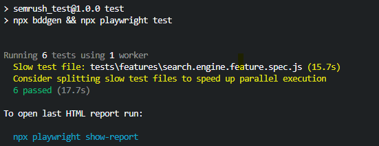

# semrush_test

These are the test cases, written in regular English for a test management system:

Test case #1: 
Searching for the word "semrush" on bing.com, filtered by content category: News, Image, Videos.

    **Steps to reproduce:**
    1. Go to https://bing.com;
    2. Accept or reject cookies in the respective popup if appears;
    3. Input *"semrush"* in the search input field and hit {Enter} or click [Search the web];
    4. Click [NEWS] and verify the result;
    5. Click [IMAGES] and verify the result;
    6. Click [VIDEOS] and verify the result;

    **Expected result:** 
    1. Search result is not empty:
    2. Serch result is filtered by content and represented as:
       - links to the sources with news content and respective thumbnails in case of "News";
       - links to the sources with grafic content and respective thumbnails in case of "Image";
       - links to the sources with video content and respective thumbnails in case of "Video";

Test case #2:
Searching for the word "prowly" on google.com, filtered by date.
    
    **Steps to reproduce:**
    1. Go to https://google.com;
    2. Accept or reject cookies in the respective popup if appears;
    3. Input *"prowly"* in the search input field and hit {Enter};
    4. Click [Tools] => click [Any time];
    5. Choose [Past 24 hours] and verify the result;
    6. Choose [Past week] and verify the result;
    7. Choose [Past month] and verify the result; 

    **Expected result:** 
    1. Search result is not empty:
    2. Serch result is filtered by date and represented as:
       - links to the sources tagged 'XX hours ago' in case of "Past 24 hours";
       - links to the sources tagged 'XX days ago' in case of "Past week";
       - links to the sources tagged 'XX(day) XXX(Month) XXXX(Year)' in case of "Past month"; 

---
# Test automation framework 
This test automation framework is built to execute search and filter results tests using bing and google engines.

Build on the basis of Playwright togather with playwright-bdd library as test runner with Gherkin syntax.

Test cases written in Gherkin syntax are represented in the 'search.engine.feature' file.

---

# How to execute tests
To execute tests run the following command in the console: 

*npm run test*

After tests are executed you will see the following result:

To see test run report, execute the following command in the console:

*npx playwright show-report*

Test report will be generated on on localhost as HTML:

